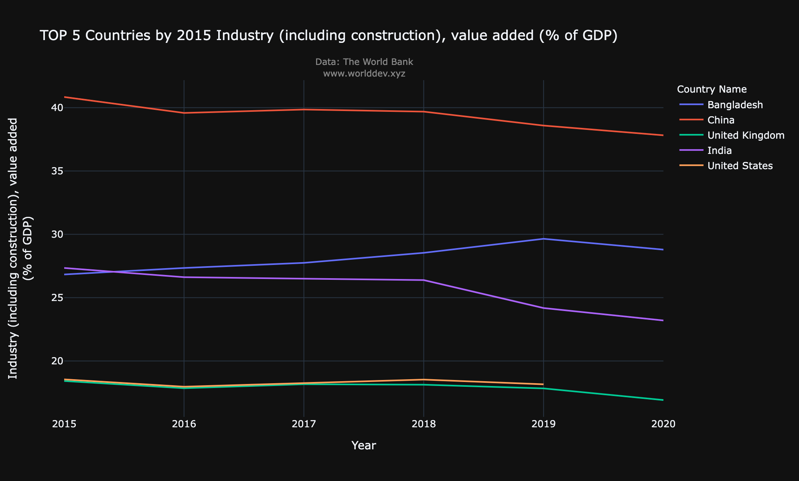
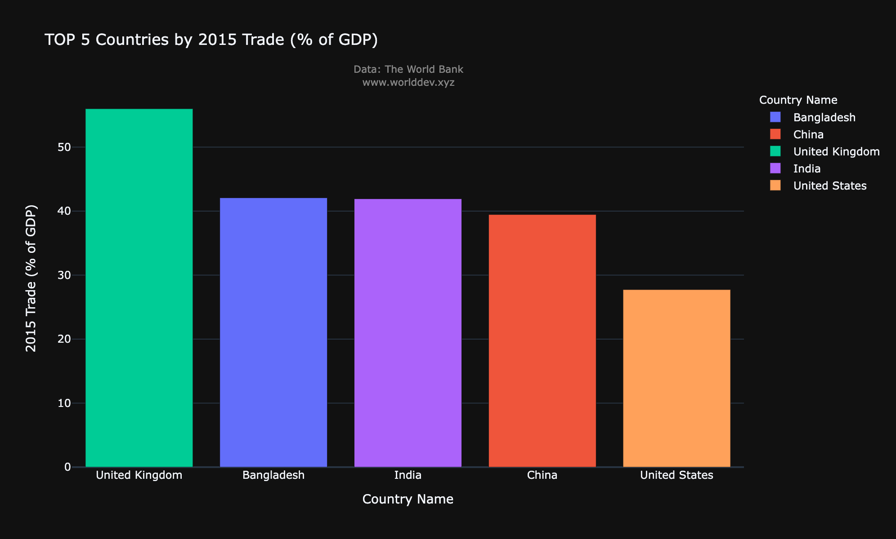
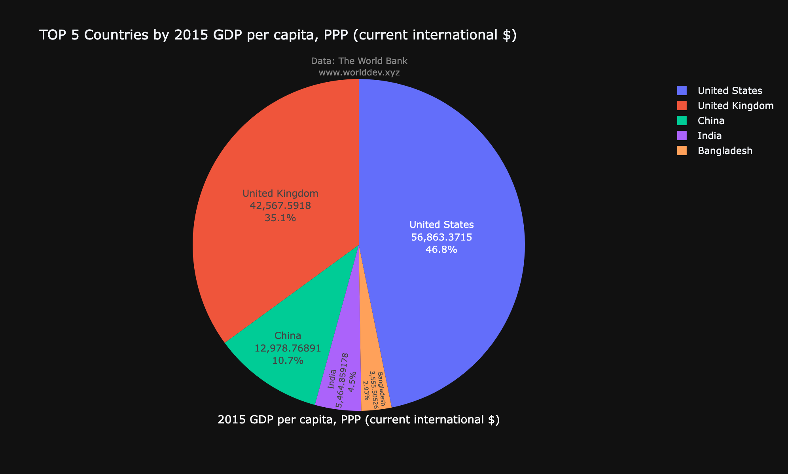

# Factors that affect countries economy and growth
- Name: Sai Teja Avadhootha
# Topic:
- Economy and Growth
# Indicators:
- Exports of goods and services (% of GDP)
- Industry (including construction), value added (% of GDP)
- Trade (% of GDP)
- GDP per capita, PPP (current international $)
# Countries compared:
- India
- China
- United states
- United Kingdom
- Bangladesh
# Introduction:
- Economic growth can be defined as the increase or improvement in the market value of the goods and services produced by an economy over time. This growth is also directly proportional to percent rate of increase in the real Gross Domestic Product(GDP).
# Economic growth due to exports of goods and services:
- Growing export sales provide revenues and profits for businesses which can then increase in capital investment. Higher investment increases a countries productive capacity which then increases the potential for exports.
 
- The above Bar graph depicts the percentage of exports of goods and services providing to its GDP by different countries in the year 2015.  
- Exports of goods and servieces of United Kingdom serves 27.2% to its GDP and stand at the top which serves more percentage to GDP through its exports.
- Despite having more advancement in technology and infrastructure United states stands at the last by only serving 12% to its GDP through the exports.
- China stands second by serving 21%, India by 19% and Bangladesh by 17%. 
# Economic growth due to Industries:
- Industrial developements have historically led to periods of economic growth. Industrialization provides increased employement opportunities thereby increasing the income of the community which leads to increase in the economic growth of the country.

- The above graph shows us the percentage of the countries GDP which is provided by the industries from 2015-2020.
- In this china tops the list with 37% of its GDP is provided by the industries. Despite having a slight downfall from the year 2019 because of the pandemic still china stands tall by the end of 2020.
- India starts at second place with 27% of its GDP is provided by industries and ends up in the third place by the end of 2020 with 23%.
- Bangladesh is the only country whose stats keeps on improving by the years and due to the pandemic percentage decreased by 1% from 2019-2020.
# Economic growth due to Trades:
- Countries that are open to International trade tend to grow faster, improve productivity and provide higher income and more opportunities to their people which helps in economic growth of the respective country.

- The above graph shows us that 56% of United kingdom’s GDP is serving by its international trading. Whereas, United states only serve 26% through its trading programs.
## GDP per capita, PPP (current international $):
- Gross domestic product (GDP) is a measurement that captures a country's economic output. Countries with larger GDPs will have a greater amount of goods and services generated within them.

- From the above pie chart we can clearly get to conclusion that the United states have the highest GDP of 46.8% and bangladesh having the lowest GDP of 2.93%. Despite having the low contributions from exports and trading to United states, Science and technology is which helped in getting the country more GDP when compared to others.
# Conclusion:
From the above information we got to know how exports of goods and services, Industry and Trade contribute their part in the economic growth of the respective countries. Also we compared the GDP per capita of 5 countries.
